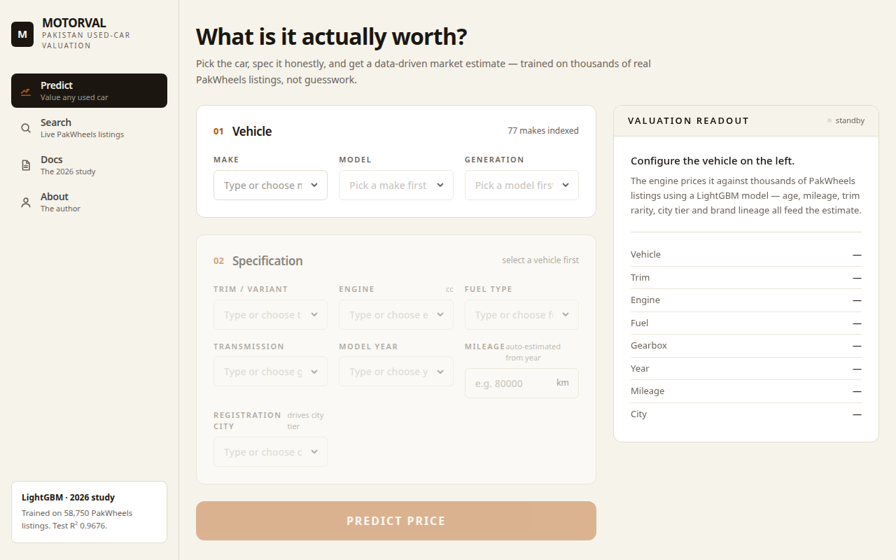
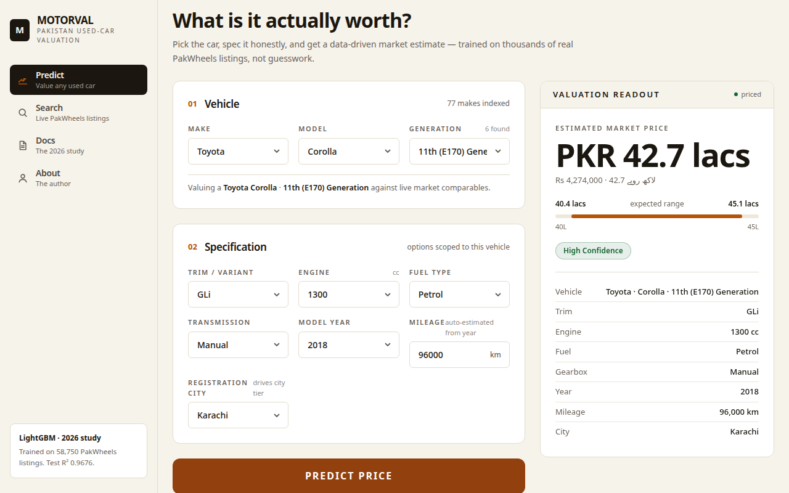
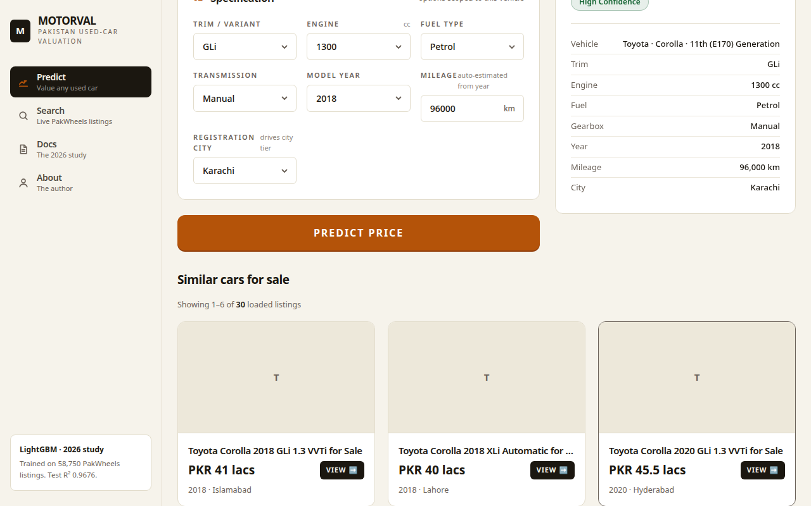

# MotorVal — Vehicle Price Valuation App
### A premium redesign of the Pakistani Used Car Price Predictor — Domain-Specific Feature Engineering and Explainable Machine Learning for Used Vehicle Valuation in Pakistan

<div align="center">

[](https://react.dev)
[](https://vitejs.dev)
[](https://vehicle-price-valuation-app.vercel.app/)
[](https://lightgbm.readthedocs.io)
[](https://shap.readthedocs.io)
[](LICENSE)

</div>

---

## Live App

<div align="center">
  <h3><a href="https://vehicle-price-valuation-app.vercel.app/" target="_blank">🚗 Try MotorVal Live</a></h3>
</div>

---

## Project Overview

A complete, premium rebuild of the [Pakistani Used Car Price Predictor](https://github.com/harisyar-ai/pakistani-car-price-predictor) — the ML implementation companion to the research paper *"Domain-Specific Feature Engineering and Explainable Machine Learning for Used Vehicle Valuation in Pakistan"* (submitted to the **International Journal of Data Science and Analytics (IJDSA), Springer**).

The original Streamlit app proved the model. **MotorVal rebuilds the experience from scratch** as a fast, polished, production-grade web app:

- ⚡ **Instant valuations** — the exact research LightGBM model (R² = 0.9676) served via Vercel serverless functions, with prediction parity verified against the Streamlit app
- 🔍 **Live PakWheels listings** — real market listings fetched on demand
- 🎯 **Price-ranked recommendations** — similar listings sorted by closeness to the *predicted* price first (in-range + year match leads), then year, city, and generation
- 📄 **Paginated browsing** — 6 listings per page with Previous/Next navigation
- 🔎 **Searchable everything** — type-to-filter comboboxes across 77 makes ordered by real market volume (Suzuki, Toyota, Honda on top — not A–Z)
- 📊 **Transparent predictions** — feature contribution breakdown, confidence badges, and price-range visualization for every valuation
- 📱 **Mobile-first** — snap-scroll carousels and responsive grids that work on any screen

> This repository contains the redesigned application. The original research pipeline (data, training, Streamlit app) lives in [pakistani-car-price-predictor](https://github.com/harisyar-ai/pakistani-car-price-predictor).

---

## Screenshots

| Predict | Result | Similar listings |
|---|---|---|
|  |  |  |

---

## Why This Project Matters

Car prices in Pakistan are highly volatile — driven by currency fluctuations, import policy changes, dealership margins, and city-level demand disparities. Buyers and sellers typically rely on guesswork or outdated references, with no standardized valuation system available.

This project introduces a **data-driven, transparent, and explainable valuation pipeline** built on real market data from PakWheels.com.

**Key problems addressed**
- Inconsistent pricing across cities and dealers
- Absence of reliable, data-backed online valuation tools
- Lack of explainability in price estimates
- Difficulty in comparing vehicles with similar specifications

**Who benefits**
- Individual buyers and sellers
- Dealerships and showrooms
- Automotive finance and insurance sectors
- Researchers studying used vehicle markets in emerging economies

---

## The Model

Final model: **LightGBM** — Test R² = **0.9676**, RMSE = **0.1416**, MAE = **0.0899** (log-price scale), selected from 13 trained candidates (XGBoost, CatBoost, Random Forest, and others).

**Key engineered features**
- `car_age` — derived from model year relative to listing year
- `brand_origin` — brand grouped by country/region of manufacture
- `city_tier` — city-level demand classification
- `trim_tier_s4` — trim-level tier (4-level scale)
- `is_electric` — EV/hybrid flag

SHAP values explain every prediction — each estimate can be traced back to its driving features.

The production model (`api/lgbm.pkl`) is the **exact artifact from the research pipeline** — prediction parity with the Streamlit app verified to the rupee.

---

## Repository Structure

```text
📁 vehicle-price-valuation-app/
├── api/
│   ├── predict.py              ← Serverless valuation endpoint (LightGBM)
│   ├── search.py               ← Live PakWheels listings + price ranking
│   ├── lgbm.pkl                ← Production model artifact
│   └── libgomp.so.1            ← Bundled OpenMP runtime for Vercel
├── src/
│   ├── components/
│   │   ├── VehicleStep.jsx     ← Make → Model → Generation (searchable)
│   │   ├── SpecStep.jsx        ← Trim/engine/fuel/specs (searchable)
│   │   ├── ListingCards.jsx    ← Carousel + paginated listing cards
│   │   └── Combobox.jsx        ← Type-to-filter dropdown component
│   ├── pages/
│   │   ├── PredictPage.jsx     ← Valuation flow + similar listings
│   │   ├── SearchPage.jsx      ← Live listing search
│   │   ├── DocsPage.jsx
│   │   └── AboutPage.jsx
│   └── lib/
│       ├── api.js              ← API client
│       └── brands.js           ← Market-volume brand ordering
├── public/
│   └── dropdown_data.json      ← Vehicle catalogue (77 makes)
├── screenshots/                ← App screenshots
└── vercel.json
```

---

## Tech Stack

| Layer | Technology |
|---|---|
| Frontend | React 19 + Vite + Tailwind CSS |
| API | Vercel Python serverless functions |
| Model | LightGBM (exact research artifact) |
| Data | Live PakWheels listings, 77-make catalogue |
| Hosting | Vercel |

---

## Run Locally

```bash
git clone https://github.com/harisyar-ai/vehicle-price-valuation-app.git
cd vehicle-price-valuation-app
npm install
npm run dev
```

> The `/api/*` endpoints require the Vercel runtime (or `vercel dev`) for the Python serverless functions.

---

## Authors

**Muhammad Haris Afridi** (First Author / Corresponding)
BS Artificial Intelligence, University of Agriculture Peshawar
Research Assistant, Digital Image Processing Lab, Islamia College Peshawar
[github.com/harisyar-ai](https://github.com/harisyar-ai) · [linkedin.com/in/harisyar-ai](https://linkedin.com/in/harisyar-ai)

**Zoraiz Elya** — Sejong University
**Muhammad Mohsin** — University of Lahore

---

## License

MIT — see [LICENSE](LICENSE) for details.
